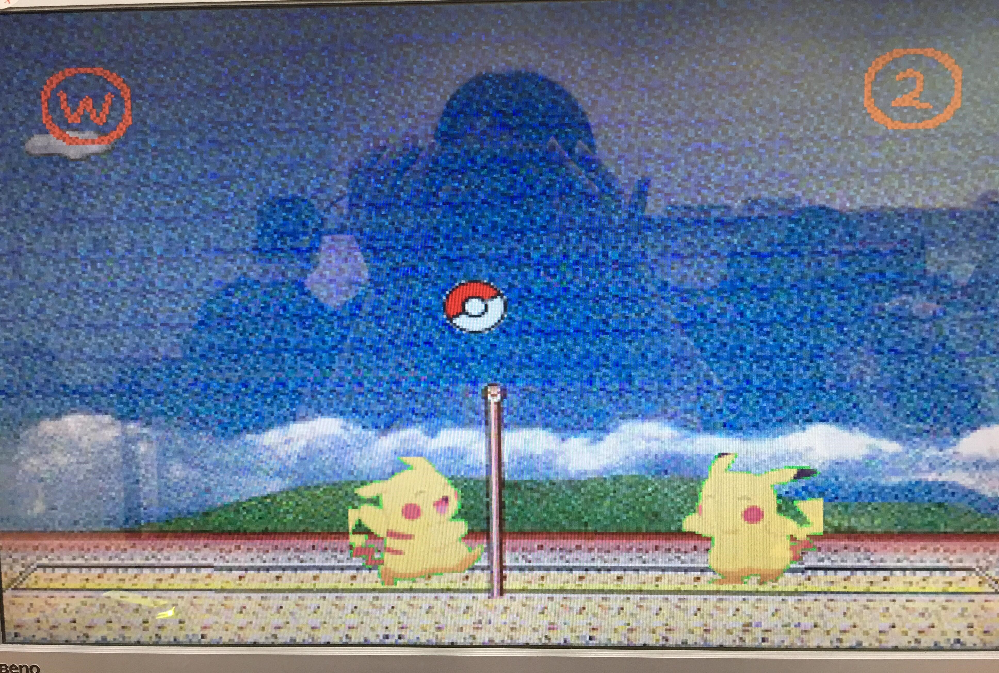
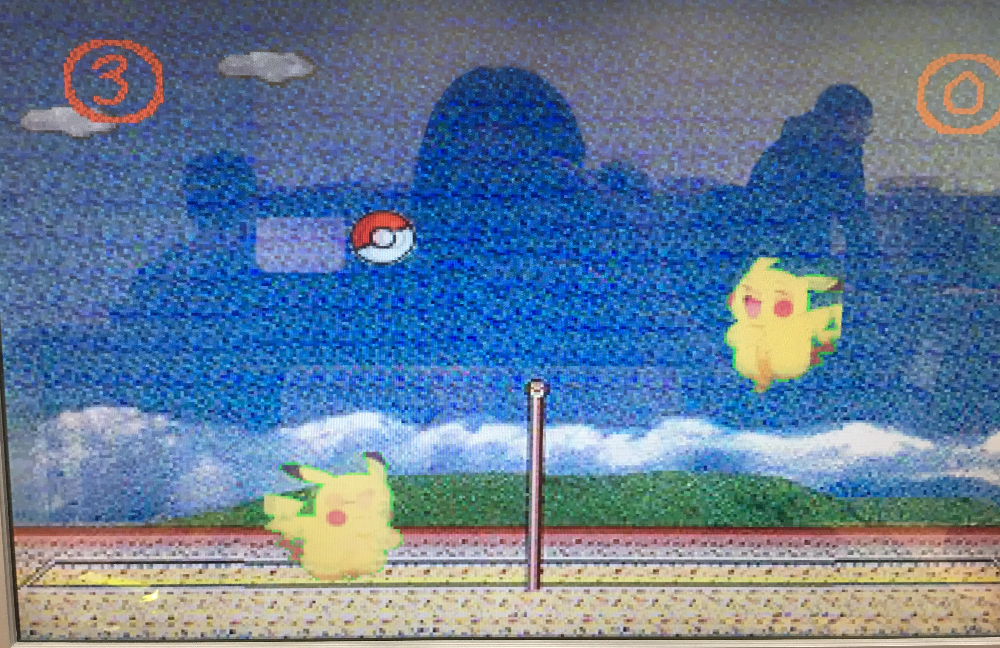

# Using Verilog to implement pika_play_volleyball on FPGA board

## 簡介

- 時代的眼淚，經典的PC遊戲，簡單的前後移動+跳躍+殺球，卻是風靡了一代人呀，沒看過神奇寶貝，也該要玩過這款遊戲呀!!

- 操作說明
    - 使用BTN控制右邊的皮卡丘，左方皮卡丘由FPGA控制，當球落在對方場上就得分，先獲得10分者獲勝，獲勝後遊戲停止。
    - RESET: 重新開始
    - BTN3 : 殺球
    - BTN2 : 左移
    - BTN1 : 往上跳
    - BTN0 : 右移

## 實作到的功能
- 基礎功能
    - 畫出一名皮卡丘玩家
    - 玩家可沿地面左右移動
    - 畫出另外一名程式控制的皮卡丘
    - 程式控制的皮卡丘會自行移動接球
    - 畫出一顆球與中間的網子
        - 玩家不能穿過網子
        - 球只能從上方通過
    - 球碰到邊界、玩家、網子時，球會直線回彈
    - 遊戲畫面有邊界
    - 使用button進行遊戲的控制與互動
- 進階功能
    - 設計計分系統(先得到10分的玩家獲勝)
    - 設計球碰到玩家時，球會拋物線回彈
    - 設計玩家可以跳躍
    - 設計玩家可以殺球，並讓球變快

## 遊戲畫面
 

## Demo Video
<iframe src="./demo/pikademo.mp4" width="500" height="281" frameborder="0" webkitallowfullscreen mozallowfullscreen allowfullscreen/>

